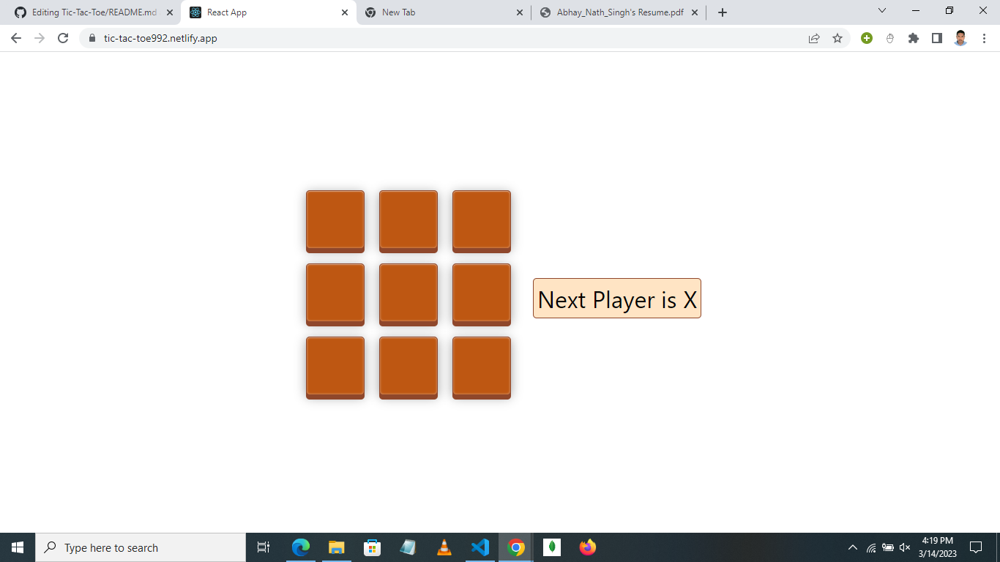
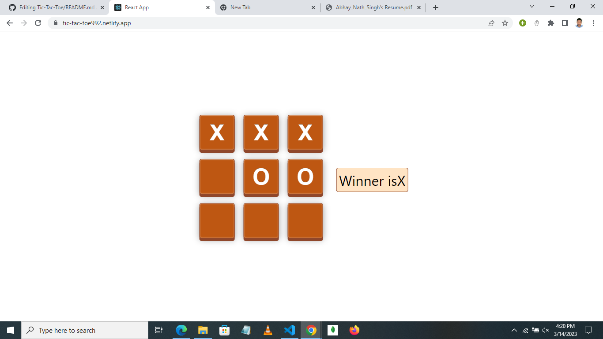

## `LINK` -https://tic-tac-toe992.netlify.app/

### A simple multiplayer tic-tac-toe built in ReactJS,CSS for two players.
### The player who succeeds in placing three of their marks in a horizontal, vertical or diagonal row wins the game.

### The result of the game is displayed at the end of the game.

